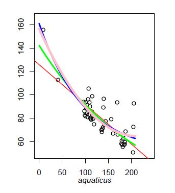

# Oxygen trace analysis pipeline

---

### About the raw data
Oxygen trace data was collected using a PyroScience OXB50 or OXR50 probe and FireSting GO2 meter. Both oxygen and temperature probes were submerged into a test environment containing a diving lizard. In each trial, we attempted to insert the oxygen sensor into the bubbles produced by the  diving anole. Before the start of each trial (and at the end), the oxygen probe was held above the water to get a few seconds' worth of reading of the average pO2 in the room (which the lizards would have had access to prior to submersion).

Three sensors were used (two different types); all measurements were fully compatible. One sensor funtioned only in air, whereas the other two functioned in air and water. The air-only sensor was convenient in that it allowed us to note with certainty which values were from bubble reads (non-bubble reads were blank values). We were able to use this sensor for Colombia, Mexico, and <i> A. aquaticus </i> from Costa Rica. Measurements from Ecuador and for <i>A. oxylophus </i> from Costa Rica were done with air/water reading sensors. 

Bubble reads could be distinguished from water reads by sensor 'intensity', another measurement recorded each second by the sensor. Water intensities were much lower than air, which allowed us to separate out bubble reads. The intensity threshold was not entirely uniform--we had to tailor it to each trial. Raw oxygen sensor data files are available upon request, but are not included with this repository.

Trace data were downloaded from the sensor using the [PyroScience manager software](https://www.pyroscience.com/en/products/all-meters/fsgo2#downloads)

Trace files were manually converted to Excel CSV format. Room oxygen reads at the start and end of trial were checked in case sensor drift/calibration errors had occurred. 

For each oxygen recording, the following metadata was assembled and placed into the "rebreathe_test_path_tl.csv" file.
  * path to trace .csv file
  * Start of submersion (see description below)
  * End of submersion (see description below)
  * Room oxygen value (average of period preceding submersion)
  * Average water temperature
  * Approximate O2 sensor reading when in water

Additional notes:
   * Start: the first non-room air measurement (usually either a blank measurement, or a measurement whose intensity indicated the sensor was in water)
   * End: The measurement the sensor was returned to room air (there would be a large jump in oxygen value back to the original air value)
   * Room oxygen: since the sensor tended to shown an increased amount of noise when in room air with water residue, we chose to use the readings before initial submersion to calculate average room air O2 partial pressure.

  * Removal of outliers: some manual removal of outlying points caused by experimentor error was also done for a handful of trials; due to the difficulty of inserting the probe, experimentors would sometimes accidentally remove the probe from water for a second or two while adjusting position, or press the probe against the lizard's scales. The former mistake would lead to one or two 'room air' reads, which we would remove. The latter would lead to low (near 0) oxygen values that we likewise also remove. Values were only removed if we were certain that they were due to these mistakes.

  * Trials where no reads were obtained were not considered (this happened frequently, since lizards were often uncooperative).

### Rebreathing trace analysis pipeline

  * All rebreathing trace analyses were done using the code in the "trace_plots_all.R" script. This script has seven sections:
  
 1. Read in paths to each trace (from "rebreathe_test_path_tl.csv"), remove juveniles
 2. Analyze the oxygen decline pattern of each trace
      * Check 4 different models--linear decline, parabolic decline, exponential decay, exponential decay with non-zero asymptote; compare AIC/likelihoods, determine best model for each trial
      * Since we had no biological hypothesis for the quadratic model, we removed it from consideration
      * <i>nlme</i> frequently could not successfully estimate 3 parameters for the asymptotic exponential decay model, and fits were poor
      * We therefore only considered exponential decay and linear decline models in the paper
      * If there was an AICc >= 2 difference between the exponential and linear models (favouring the exponential), we selected it as the 'best fit' for that trial. If the AICc score for the linear model was lower than, or less than 2 greater than the AICc score of the exponential model, we selected it as the 'best fit'
      * This segment of the script synopsizes trials to just the start/end of submersion, sets the start time to 0, conducts model fits, and outputs them to a .csv file (along with metadata--duration, number of reads)
      * Data from this segment is used in table S3a
      * This segment also prints out all rebreathing traces for visual analysis
        * Linear best fit lines are in red; exponential best fit lines are in green; asymptotic exponential decay best fit lines are shown in blue; quadratic best fit lines are pink
		
	   
	   
 3. Trace filtering
      * Some traces were very short, or had very few reads (and so did not provide much of a picture of oxygen pressure through time)
      * To prevent these trials from obscuring oxygen decline patterns, we removed any trial that was below 100 seconds in duration, had fewer than 10 reads, or had a linear model fit of less than 0.75 (indicating excessive noise or other measurement problems).
      * To avoid pseudo-replication, we also selected only one trial per individual (the longest trial was taken to be the 'best performance')
 4. Trace model analysis
      * This section of the script checks for trends in slope/model fit/half-life given trial/lizard metadata (e.g., trace duration, lizard mass, snout-vent length (SVL)
      * These analyses form the bulk of the results reported in table S3 (b-d)
 5. Plot all trials that met filtering criteria
      * Figure S4
 6. Plot one sample plot per species, assess aquatic anole oxygen consumption
      * Generate Figure 4 (one demonstrative plot per species, one example sham for comparison, oxygen consumption plot)
      * This script makes uses of a synopsized version of a function from the <i>propagate</i> package; the predictNLS function usually generates both Monte Carlo and Taylor Expansion estimates of CIs for nls functions; since Monte Carlo simulations take a good deal of time and yielded equivalent results, we used just the Taylor expansion estimation (see "propagate_taylor_only.R")
      * The oxygen consumption plot was inspired by reviewer comments
      * We calculated nmol of oxygen lost per second using our available pressure loss per second data and using the Iguana lung volume:mass ratio from Perry 1998 (in Biology of the Reptilia)
      * We compared these values to the literature values reported for plastron forming insects, and theoretical oxygen demand and plastron supply rates plotted in [Seymour and Matthews 2013](https://jeb.biologists.org/content/216/2/164). We thank Seymour and Matthews for providing us with the data from this paper!
      * This section of the script calls "oxygen_consumption.R", which contains a function to plot the oxygen consumption figure (4g) which was created during review. See commented code in that file for additional details.
      * Note: plot spacing was edited in Inkscape after output; spacing in the outpdf will not be identical to the paper (but all plots will be)
 7. Plot all sham trials
      * Figure S3
      * Text summary stats were added to the SOM manually, but are printed by this section
	  * A sixth sham trial was conducted, but was discarded due to noticeable upward sensor drift (appears identical to plots shown except for upward drift, data available upon request)

